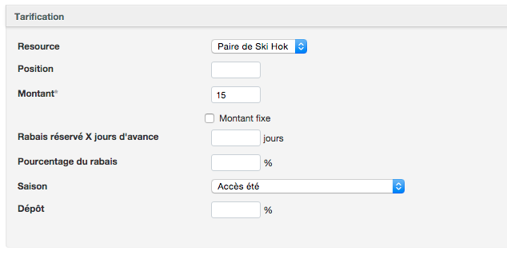

# Assignation de ressources

Les ressources servent à partager un inventaire entre différents produits pouvant être réservés en ligne.

Voici quelques exemples d'utilisation de ressources : 

* [Réservation de refuge par lit ou en exclusivité](reservation_de_refuge_par_lit_ou_en_exclusivite.md)
* [Appliquer un inventaire de kayaks à une activité guidée et à une réservation de kayak à l'heure. ](appliquer_un_inventaire_de_kayak_a_une_activite_guide.md)

####Créer une ressource et établir sa capacité
Pour créer une ressource, suivez les étapes suivantes:
1. Allez dans inventaire -> Ressources
2. Cliquez sur " *Ajouter une nouvelle ressource* "
3. Ajoutez le nom de la ressource
4. Indiquez la quantité et la capacité de votre ressource
5. Sauvegardez la ressource

*Exemple: Si vous avez 10 canots et que chacun peut accueillir deux personnes, vous devez alors indiquer 10 dans quantité et 2 dans capacité*

####Assigner une ressource à une activité, un hébergement ou un équipement

En créant une activité, un hébergement ou un équipement, vous pouvez l'assigner à une ou plusieurs ressources. Ces ressources peuvent être partagées entre différents articles de votre inventaire. Cela vous permettra de gérer la capacité de votre inventaire sans avoir des conflits.

Après avoir créé votre article, suivez les étapes suivantes pour assigner une ressource.
1. Cliquez sur le bouton *Ajouter une ressource*
2. Sélectionnez votre ressource dans la liste ou ajoutez une nouvelle si elle ne figure pas dans votre liste.
3. Sélectionnez les options qui s'appliquent à l'usage de la ressource. 
4. Sauvegardez

Les options offertes vous permettront de 

#### Prix des ressources

Il est possible d'ajouter des tarifs à vos ressources. Cette option vous permettra de charger des frais pour la location d'une ressource nécessaire à l'activité en question.

Pour ajouter des prix aux ressources, suivez les étapes suivantes:

1. Allez dans le menu Activités
2. Repérez l'activité désirée
3. Cliquez sur le lien **"Changer les liens des ressources"**
4. Sélectionnez la ressource désirée
5. Ajoutez le prix que vous désirez charger
6. Spécifiez la saison pour laquelle la tarification est en vigueur

Vous pouvez ajouter des prix pour chacune des ressources utilisées, ainsi que plusieurs tarification. 

**Exemple**: une activité requiert la location d'un kayak. En configurant l'activité, vous pouvez spécifier l'inventaire de kayak en tant que ressource et ajouter la tarification par type de participant.
Une fois l'activité créée, vous pouvez spécifier le prix des ressources. Le prix de la ressource sera ajouté au panier d'achat. Votre client sera en mesure de consulter les détails dans le panier d'achat.

La ressource sera ajoutée selon la capacité indiquée lors de sa création et le nombre de participant à l'activité.Cela étant dit, vous gardez le contrôle et pouvez modifier la quantité de ressources ajoutées à la commande du client.

####Pour modifier la quantité de ressources:

1. Prenez la commande du client en sélectionnant la date, le type de participant et la quantité désirée
2. Passez à la caisse
3. Cliquez sur le lien **"Éditer"** à côté de la ressource
4. Modifiez la quantité pour celle désirée
5. Sauvegardez

**Exemple:** Une activité de canot offre la possibilité de placer deux adultes et un enfant ou deux enfants et un adulte dans le même canot. Or, la ressource est configurée pour accueillir un maximum de deux participant par embarcation. Vous aurez la possibilité de modifier le nombre de ressources ajoutées simplement grâce à cette fonctionnalité.
