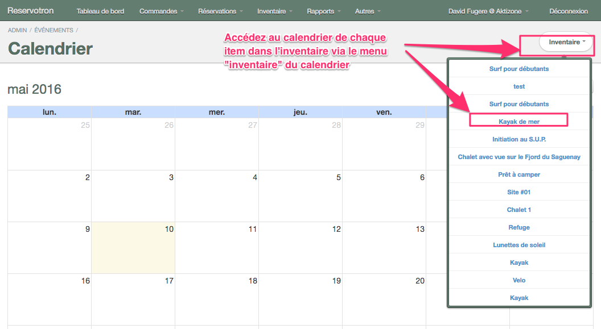

# Calendrier

Le calendrier vous permettra de visualiser vos réservations et vos disponibilités. Vous pouvez sélectionner le mois désiré et Réservotron chargera alors l'ensemble des informations relatives aux dates sélectionnées.

Chaque item de votre inventaire a son propre calendrier. Vous pouvez le consulter en cliquant sur le bouton **ACTION** puis sélectionnez **CALENDRIER**. 

Vous pouvez également utiliser le calendrier général pour naviguer à travers tous les items de votre inventaire. Cette option vous permettra de facilement basculer entre différents calendriers et vérifier vos réservations et disponibilités. 

**Pour naviguer dans vos différents calendrier :**
1. Allez dans Réservotron - **TABLEAU DE BORD**
2. Cliquez sur le bouton **CALENDRIER** - le calendrier de votre mois affichera alors l'ensemble des réservables. 
3. Cliquez sur le bouton **INVENTAIRE**
4. Sélectionnez l'item désiré dans la liste
5. Le calendrier du réservable s'affichera pour le mois (vous pouvez changer de mois à l'aide des flèches)

