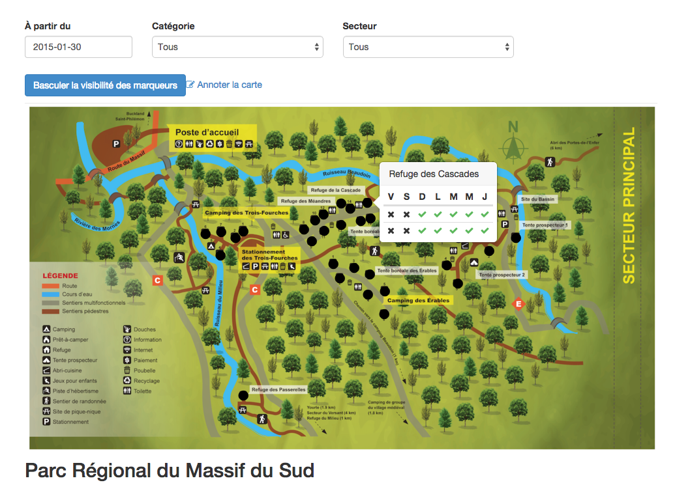

# Cartes interactives

Les cartes interactives vous permettront d'afficher une carte dans votre section *Hébergement*. Vos clients pourront vérifier la disponibilité d'un site, puis le réserver en cliquant dessus. 

À noter que l'utilisation d'une carte interactive requiert la création d'un hébergement de niveau *site*. 

***Pour créer une carte interactive:***
1. Allez dans inventaire 
2. Sélectionnez *"Hébergement"*
3. Sélectionnez *"Site"* dans le filtre niveau (voir image ci-dessous)
4. Cliquez sur le bouton *"Filtrer"*
5. Cliquez sur le lien *"Modifier"* de l'hébergement affiché
6. Choisissez une image dans la case *"Carte"*
7. Sélectionnez *"oui"* dans la case "Publiée"

8. Ouvrez votre page Réservotron
9. Cliquez sur *"Hébergement"* - (Votre carte paraitra en haut de la page)
10. Cliquez sur le lien *"Annoter la carte"*
11. Cliquez sur l'emplacement désiré sur la carte
12. Sélectionnez l'hébergement désiré dans la liste
13. Cliquez sur *"Sauvegarder"*

La couleur que vous avez déterminez lors de la création de votre catégorie sera celle utilisée pour annoter la carte. 
Si vous désirez la modifier, vous devrez effectuer les changements dans la configuration de la catégorie en question. 

Pour plus d'informations sur la procédure à suivre pour assigner une couleur à une catégorie, consultez notre section ***[Catégories](cat.md)***

**Vos clients pourront ainsi voir les disponibilités des hébergements directement sur la carte. **

**En cliquant sur un site, le client sera immédiatement redirigé vers la réservation en ligne de l'hébergement désiré. **

Si vous avez besoin d'assistance dans la création d'une carte interactive, contactez le [support](mailto:info@reservotron.com) de Réservotron. 