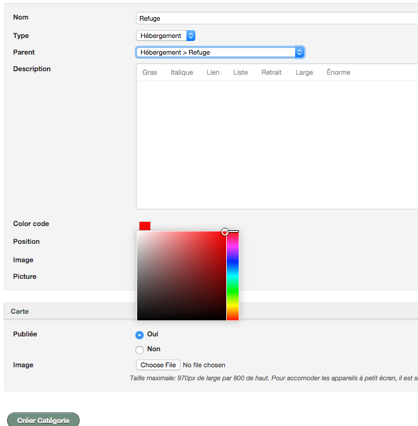
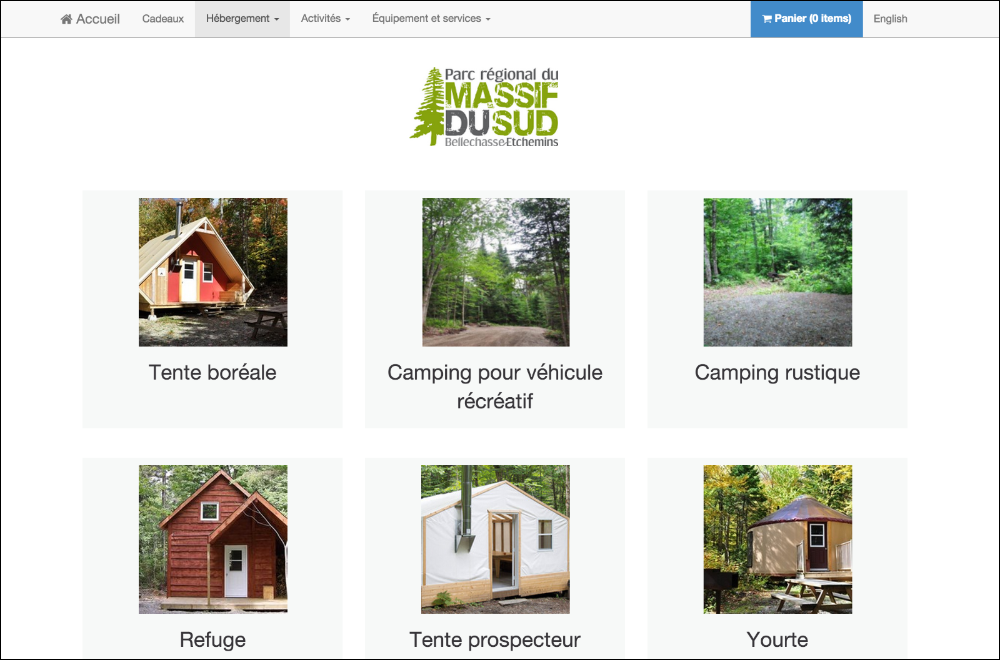

# Catégories

Les catégories vous permettent d'organiser votre inventaire. Il vous sera ainsi possible d'assigner chaque hébergement, activité, équipement et service à des catégories différentes. 

Vos clients pourront facilement trouver l'information dont ils ont besoin en se reférrant à la catégorie désirée. 

Pour créer des catégories, suivez les étapes suivantes:
1. Allez dans le menu ***Autres*** et sélectionnez ***Catégories***
2. Cliquez sur ***Ajouter une catégorie***
3. Entrez les informations désirées telles que le nom de la catégorie
4. Sélectionnez le type de la catégorie
5. i vous voulez assigner une catégorie "parent" à votre catégorie, sélectionnez la dans la liste déroulante.
4. Choisissez une ***couleur*** de votre choix pour représenter la catégorie. Cette dernière sera utilisée pour annoter la carte de votre site. 
4. Sélectionnez une image illustrant votre catégorie
5. Si désiré, sélectionnez une carte en cliquant sur **Choose File**. Afin de la voir, la case ***publiée*** doit être cochée.
5. Validez votre catégorie en cliquant sur ***"Créer Catégorie"***

En attribuant une image à votre catégorie, vous déterminez ce que vos clients verront lorsqu'ils voudront la sélectionner. Dans l'éventualité où vous ne mettez pas d'image, le logiciel prendra en compte la première image ajouté à un produit de la catégorie en question. 

*La couleur de la catégorie sera utilisée lors de l'annotation de la carte interactive de votre site. Pour plus d'informations sur la procédure à suivre pour en créer une, consultez la section **[Carte Interactive](cartes_interactives.md)** *.
## Positions
En indiquant une position à votre catégorie, vous influencez l'ordre dans lequel vos catégories apparaissent dans l'inventaire.
Si vous voulez qu'une catégorie apparaisse en premier, vous devrez lui attribuer une position de **1**. 
Numérotez ensuite le reste de vos catégories de sorte à obtenir l'ordre désiré. 

