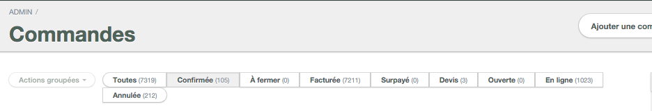
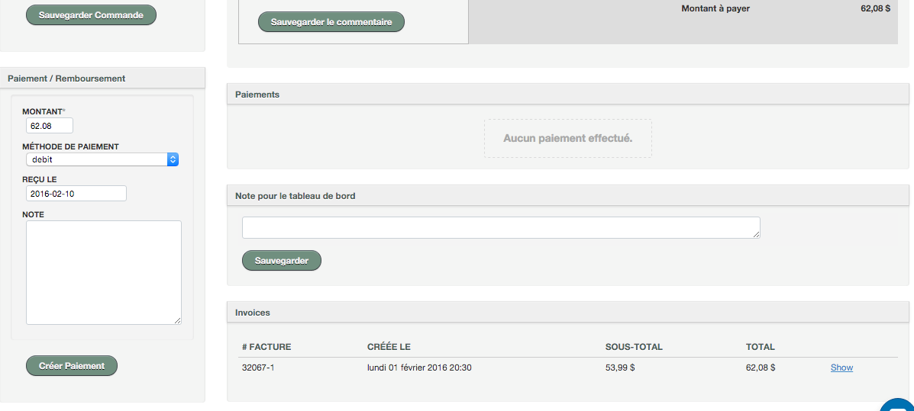

# Factures et commandes

###Commandes confirmées VS facturées

Tutoriel vidéo : https://youtu.be/589_kheivuw

**Pour accéder aux commandes** : 
1. Allez dans **MENU** et cliquez sur **COMMANDES**
2. Sélectionnez le filtre désiré : **TOUTES**, **CONFIRMÉES**, **À FERMER**, **FACTURÉES**, **SURPAYÉES**, **DEVIS**, **OUVERTES**, **EN LIGNE** ou **ANNULÉES**
3. Réservotron affichera l'ensemble des commandes correspondant au filtre sélectionné.

**Pour accéder aux factures**:
1. Allez dans **MENU**
2. Cliquez sur **COMMANDES**
3. Sélectionnez **FACTURÉES** dans les filtres
4. Cliquez sur le lien **FACTURE**
Vous pourrez consulter le détail de la facture tel que le numéro de facture, date de création, montant et plus.

