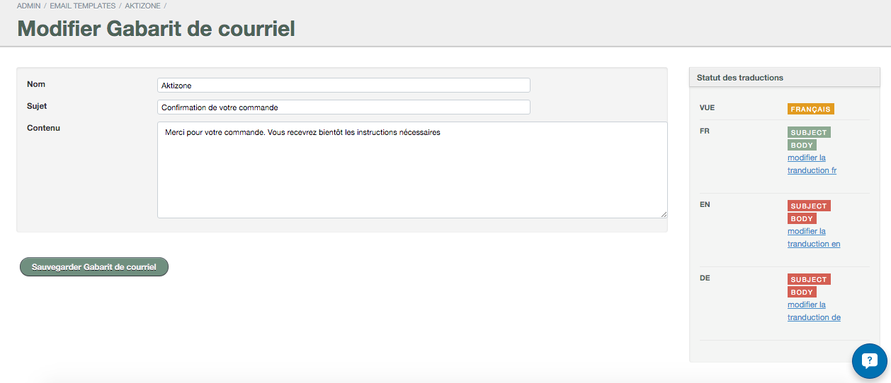
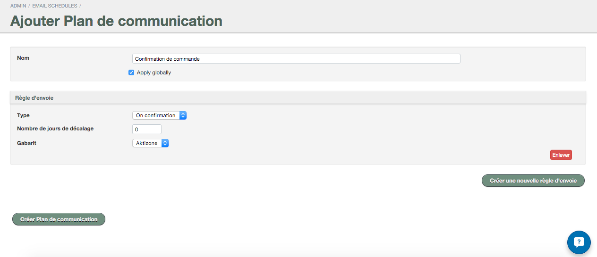

# Courriel automatisés

1. Allez dans *Menu* → *Autres*
2. Cliquez sur *Gabarit de courriel*

###Création du gabarit de courriel
1. Cliquez sur le bouton *Ajouter Gabarit de Courriel*
2. Ajoutez les informations de votre gabarit dont:

 * **LE NOM**
 * **LE SUJET**
 * **LE CONTENU DE VOTRE COURRIEL**

3. Sauvegardez le tout en cliquant sur le bouton *Créer Gabarit de courriel*
4. Répétez ces étapes pour créer l'ensemble des gabarits dont vous avez besoin. 

###Création des scénarios d'envoi
Une fois vos gabarits créés, vous devez configurer vos scénarios d'envoi. Pour cela:

1. Allez dans *Menu* → *Plan de communication*
2. Cliquez sur le bouton *Ajouter plan de communication*
3. Ajoutez le nom du plan 
4. Cochez la case *Apply globally* si vous désirez que ce scénario s'applique à l'ensemble de vos réservables
5. Cliquez ensuite sur le bouton *Créer une nouvelle règle d'envoi*
6. Dans le menu *Type*, sélectionnez l'option s'appliquant au scénario parmi les suivantes:
 * ***On confirmation*** - le courriel sera envoyé une fois la commande confirmée
 * ***Before start*** - le courriel sera envoyé avant la date de la réservation
 * ***After End*** - le courriel sera envoyé à la fin de la réservation
 
7. Dans le menu *Nombre de jours de décalage*, ajoutez le nombre de jour que vous voulez laisser comme délai entre l'action sélectionnée dans l'option *Type* et l'envoi du courriel.

    Par exemple: si vous indiquez *On Confirmation* dans *Type* et *1* dans *Nombre de jours de décalage*, le courriel sera alors envoyé une journée après la confirmation de la réservation.
8. Dans le menu *Gabarit*, sélectionnez celui que vous désirez appliquer à l'envoi. Vous retrouverez l'ensemble des gabarits créés plus tôt dans la liste déroulante.
9. Validez le tout en cliquant sur *Créer plan de communication*
10. Répétez ces étapes pour l'ensemble des scénarios dont vous avez besoin. 
 
