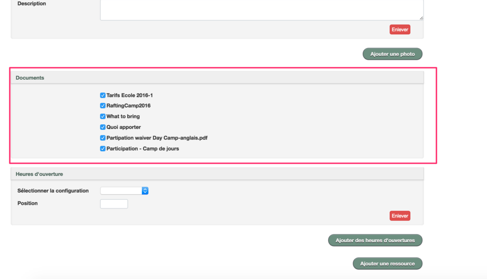
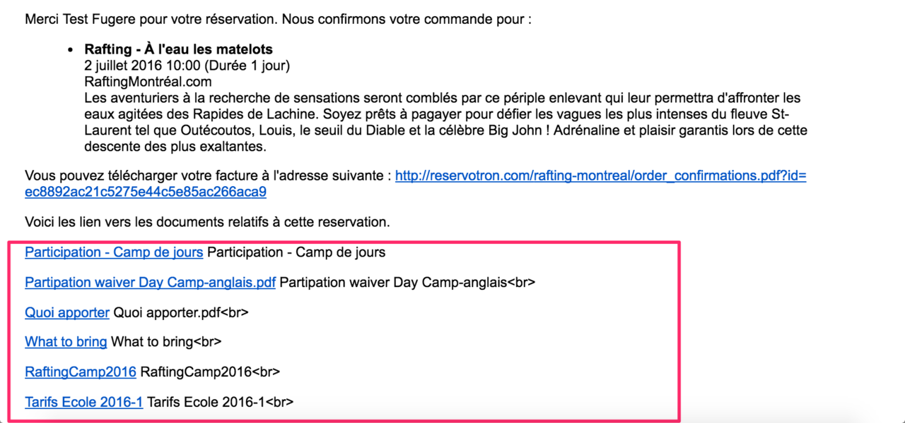

# DOCUMENTS
Le menu *Documents* vous permettra de joindre des fichiers (existants) aux réservation de vos clients. 

Suite à une réservation, le client recevra les documents dans le courriel de confirmation de la commande. 

**Pour créer des documents**

1. Allez dans le menu **AUTRES**
2. Sélectionnez **DOCUMENTS**
3. Cliquez sur **AJOUTER DOCUMENT**
4. Entrez les paramètres suivants:
  5. **NOM INTERNE** : il s'agit du nom que vous désirez donner pour l'utilisation interne. Cette appellation ne sera visible que par les employés ayant accès au compte.
  6. **NOM PUBLIC** : il s'agit du nom que vous désirez utiliser dans le courriel envoyé aux clients. Cette appellation sera visible par vos clients. 
  7. **DESCRIPTION** : ajoutez la description du document 

8. Cliquez sur le bouton **FICHIER** pour sélectionner le document à rajouter.
9. Validez le tout en cliquant sur le bouton **CRÉER DOCUMENT**.

Une fois le document créé, vous devez l'assigner à une activité ou un réservable. 

**Pour ajouter le document à votre activité**

1. Allez dans le menu **INVENTAIRE**
2. Sélectionnez **ACTIVITÉS**
3. Choisissez l'activité désirée en cliquant sur le bouton **ACTIONS** puis **MODIFIER**
4. Dans la case **DOCUMENTS**, cochez tous les documents que vous désirez joindre à l'activité.
5. Validez le tout en cliquant sur le bouton **SAUVEGARDER ACTIVITÉ** 

*Interface administrateur - modification de l'activité*:

*Courriel reçu par le client lors de la réservation*:

