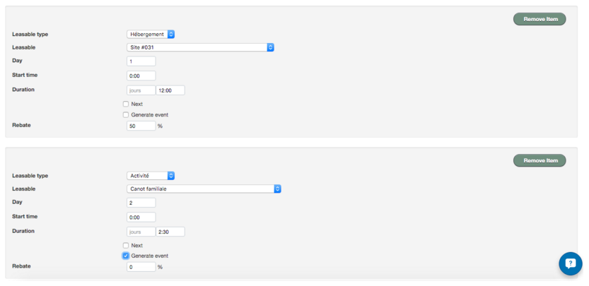
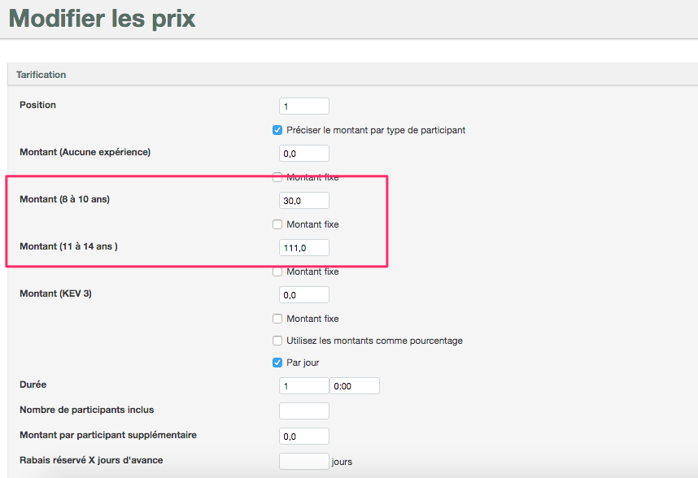
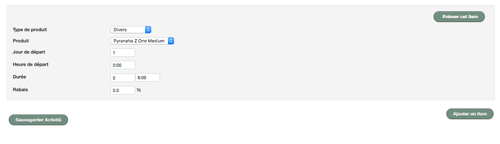
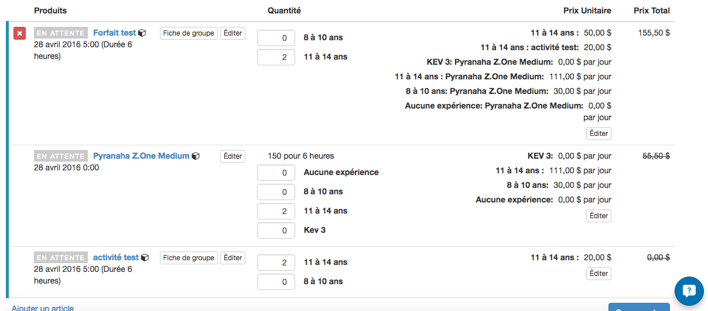

# Forfaits 

Les forfaits permettent de diversifier l’offre de l’inventaire. 

##Pour créer un forfait sur mesure :

Tutoriel vidéo : https://youtu.be/T-GksZre1TQ

####Étape 1:
1. Allez dans le menu **INVENTAIRE** → **ACTIVITÉ**
2. Cliquez sur **AJOUTER ACTIVITÉ**
3. Ajoutez les informations désirées
4. Ajoutez les types de participants
5. Sauvegardez votre activité

####Étape 2:
1. Cliquez sur le bouton **MODIFIER L'ACTIVITÉ** et sélectionnez **MODIFIER LES HORAIRES** dans la liste déroulante.
2. Ajoutez les horaires de votre activité. Vous pouvez ajouter autant d'occurence que nécessaire.
3. Sauvegardez votre horaire

####Étape 3:

Tutoriel vidéo : https://youtu.be/T-GksZre1TQ?t=184

1. Cliquez sur le bouton **MODIFIER L'ACTIVITÉ** et sélectionnez **MODIFIER LES ÉLÉMENTS INCLUS** dans la liste déroulante.
2. Cliquez sur le bouton **ADD BUNDLE ITEM**
3. Dans **LEASABLE TYPE** sélectionnez la catégorie de votre inventaire que vous désirez inclure
4. Une case **LEASABLE** apparaitra alors. Sélectionnez l'item à ajouter au forfait.
5. Indiquez le jour de où se déroulera l'item (*ex: si vous offrez  un forfait nuitée + activité, vous pourrez indiquer que la nuitée sera le jour 1 et l'activité le jour 2*). Si tous vos éléments se déroulent la même journée, indiquez "1" dans toutes les cases.
6. Ajoutez l'heure de début. Si celle-ci est la même que l'horaire ajouté à votre activité, vous pouvez la laisser 00:00 par défaut.
7. Indiquer la durée de l'élément
8. La case **REBATE** vous permettra d'ajuster le tarif de l'item tel que désiré. Par exemple: si vous voulez l'inclure gratuitement, vous devez indiquer dans rebate :  100%. Si vous voulez avoir 100% du prix, le rebate doit être fixé à 0%.
6. Répétez ces étapes pour tous les éléments que vous voulez ajouter à votre forfait.
7. Sauvegardez le forfait.

**[Pour apprendre à créer des forfaits cadeaux, cliquez ici.](forfaits_cadeaux.md)**

####Appliquer des droits d'accès par type de participant à un forfait

Vous pouvez également inclure des droits d'accès directement dans votre forfait, même si les tarifs sont différents par type de participants. Ainsi, en réservant un forfait, le client achètera automatiquement les droits d'accès nécessaires.

**Exemple de configuration de forfait pour inclure des droits d'accès:**

1. Créez votre droit d'accès (ou autre item) à partir du menu **DIVERS** et ajoutez les prix par type de participants. [Cliquez ici](creer_un_divers.md) pour consulter les étapes détaillées à suivre pour créer des droits d'accès en tant que divers. *À noter que les types de participants doivent être les mêmes que ceux utilisés dans le forfait.*
2. Ajoutez le divers à votre forfait dans les éléments inclus.
3. Dans les éléments inclus, modifiez la case **RABAIS** à 0% pour appliquer les frais. Si vous désirez que les frais soient gratuits avec l'achat du forfait, gardez **100%**. Si vous désirez appliquer tout autre rabais, indiquez le dans cette même case. 
4. Sauvegardez le tout

En réservant le forfait pour le type de participant sélectionné, Réservotron ajoutera automatiquement les droits d'accès et autres items respectifs avec les tarifs appropriés (si vous en avez demandé).

