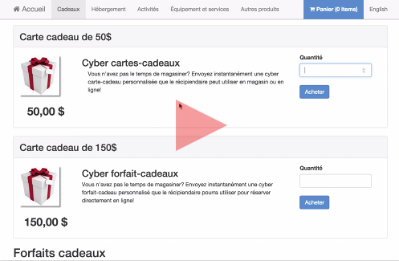

# Forfaits et certificats cadeaux

Les certificats et forfaits cadeaux permettent de diversifier l’offre de l’inventaire 

***Pour créer un forfait cadeau:***
1. Allez dans le menu “Inventaire”
1. Sélectionnez “Forfaits”
1. Cliquez sur “Ajouter Package”
1. Sélectionnez “Cadeaux” dans le type de forfait
1. Ajoutez les informations désirées
1. Sauvegardez en cliquant sur “Créer package”

Certains forfaits peuvent nécessiter une configuration plus complexe. Pour ce type de besoin, vous pouvez utiliser les activités pour configurer vos forfaits sur mesure. 

##Pour créer un forfait sur mesure :
####Étape 1:
1. Allez dans le menu *Inventaire* → *Activités*
2. Cliquez sur *Ajouter activité*
3. Ajoutez les informations désirées
4. Ajoutez les types de participants
5. Sauvegardez votre activité

####Étape 2:
1. Cliquez sur le bouton *Modifier l'activité* et sélectionnez *Modifier les horaires* dans la liste déroulante.
2. Ajoutez les horaires de votre activité. Vous pouvez ajouter autant d'occurence que nécessaire.
3. Sauvegardez votre horaire

####Étape 3:
1. Cliquez sur le bouton *Modifier l'activité* et séectionnez *Modifier les éléments inclus* dans la liste déroulante.
2. Cliquez sur le bouton *Add bundle item*
3. Dans *Leasable type* sélectionnez la catégorie de votre inventaire que vous désirez inclure
4. Une case *Leasable* apparaitra alors. Sélectionnez l'item à ajouter au forfait.
5. Indiquez le jour de où se déroulera l'item (*ex: si vous offrez  un forfait nuitée + activité, vous pourrez indiquer que la nuitée sera le jour 1 et l'activité le jour 2*). Si tous vos éléments se déroulent la même journée, indiquez "1" dans toutes les cases.
6. Ajoutez l'heure de début. Si celle-ci est la même que l'horaire ajouté à votre activité, vous pouvez la laisser 00:00 par défaut.
7. Indiquer la durée de l'élément
8. La case *Rebate* vous permettra d'ajuster le tarif de l'item tel que désiré. Par exemple: si vous voulez l'inclure gratuitement, vous devez indiquer dans rebate :  100%. Si vous voulez avoir 100% du prix, le rebate doit être fixé à 0%.
6. Répétez ces étapes pour tous les éléments que vous voulez ajouter à votre forfait.
7. Sauvegardez le forfait.

***Pour créer un certificat cadeau:***
1. Allez dans le menu “Inventaire”
1. Sélectionnez “Certificats Cadeaux”
1. Cliquez sur “Ajouter un nouveau certificat”
1. Ajoutez les informations désirées 
1. Sauvegardez en cliquant sur “Créer certificat”

Pour plus d’informations, consultez notre tutoriel sur la création de certificats cadeaux en [cliquant ici](https://www.youtube.com/watch?v=r46iZPvE0fY ) ou sur l'image ci-dessous. 

