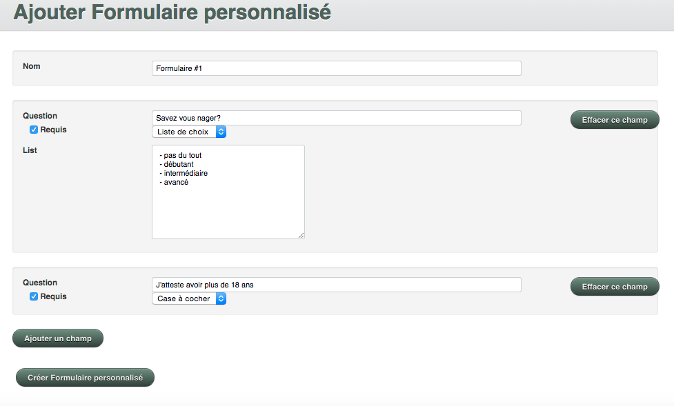
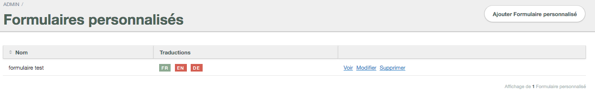

# Formulaires personnalisés

Afin de répondre aux besoins spécifiques de vos activités, nous vous offrons la possibilité d'inclure des formulaires personnalisés pour recueillir des informations précises. 

Pour créer un formulaire personnalisé:

1. Allez dans le menu **AUTRES** 
2. Sélectionnez **FORMULAIRES PERSONNALISÉS**
3. Cliquez sur **AJOUTER FORMULAIRE PERSONNALISÉ**
4. Choisissez le nom de votre formulaire
5. Cliquez sur le bouton **AJOUTER UN CHAMP** pour demander l'information en question
6. Entrez la question désirée et sélectionnez l'option pour recueillir les réponses (ligne de texte; boîte de texte, case à cocher; liste de choix)

Vous pouvez ajouter autant de champs que désiré. 

Si vous désirez rendre le formulaire obligatoire, cochez la case **REQUIS** du champ. Vos clients seront dans l'obligation de répondre à la question avant de pouvoir effectuer la réservation. 

Les renseignements recueillis par les formulaires personnalisés sont accessibles à partir des **commandes** des clients ainsi qu'à partir des **fiches de groupes**.

####Options du formulaire

**CRÉER UNE BOÎTE DE TEXTE**
1. Cliquez sur le bouton **AJOUTER UN CHAMP**
2. Entrez la question que vous désirez demander dans la case **QUESTION**
3. Sélectionnez **BOÎTE DE TEXTE** dans le menu déroulant à droite de la question

**CRÉER UNE CASE À COCHER**
1. Cliquez sur le bouton **AJOUTER UN CHAMP**
2. Entrez la question que vous désirez demander dans la case **QUESTION**
3. Sélectionnez **CASE À COCHER** dans le menu déroulant à droite de la question

*Cette option est idéale pour les confirmations que vous désirez obtenir. Par exemple: "J'ai plus de 18 ans"*

**CRÉER UNE LISTE DE CHOIX**
1. Cliquez sur le bouton **AJOUTER UN CHAMP**
2. Entrez la question que vous désirez demander dans la case **QUESTION**
3. Sélectionnez **LISTE DE CHOIX** dans le menu déroulant à droite de la question
4. Une boîte de texte blanche s'affichera. Entrez vos choix dans la boîte. Retournez à la ligne au début de chaque nouveau choix. 

*Cette option est idéale pour les choix "Oui" / "Non" ; ou encore une liste de choix à offrir aux clients*

Vous pouvez également traduire vos formulaires personnalisés pour qu'ils soient disponibles dans plusieurs langues. Le processus de traduction des formulaires personnalisés est identique à celui des items de l'inventaire. 

####Pour traduire vos formulaires personnalisés:
1. Allez dans le menu **AUTRES**
2. Sélectionnez **FORMULAIRES PERSONNALISÉS**
3. Repérez le formulaire personnalisé que vous désirez traduire
4. Cliquez sur l'abbréviation de la langue que vous voulez rajouter. Une case verte signifie que l'article a été entré avec la langue en question. Si la case est rouge, c'est qu'aucune traduction n'a été ajoutée. (Exemple: Si "**FR**" est en vert, cela veut dire que l'item est configuré en français. Vous pouvez alors cliquer sur "**EN**" pour ajouter la version anglaise.)
5. Après avoir cliqué sur la traduction que vous voulez ajouter, une page s'ouvrira avec votre configuration en français. Modifiez les renseignements et remplacez les par la traduction désirée.
6. Sauvegardez votre formulaire.

