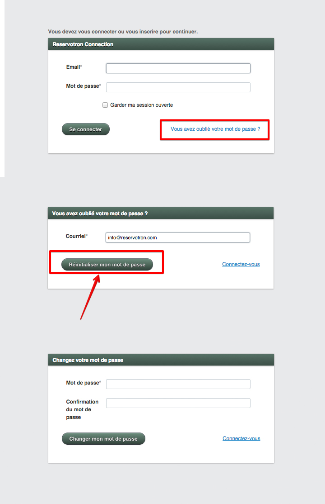

# Réinitialiser le mot de passe

Dans le cas où vous auriez oublié votre mot de passe, vous pourrez le réinitialiser facilement. 

***Pour cela:***
1. Allez à la page de connexion, soit à [reservotron.com/admin](http://reservotron.com/admin)
2. Cliquez sur le lien *"Vous avez oublié votre mot de passe"*
3. Entrez votre courriel et cliquez sur le bouton *"Réinitialiser mon mot de passe"*
4. Consulter votre boîte de réception 

