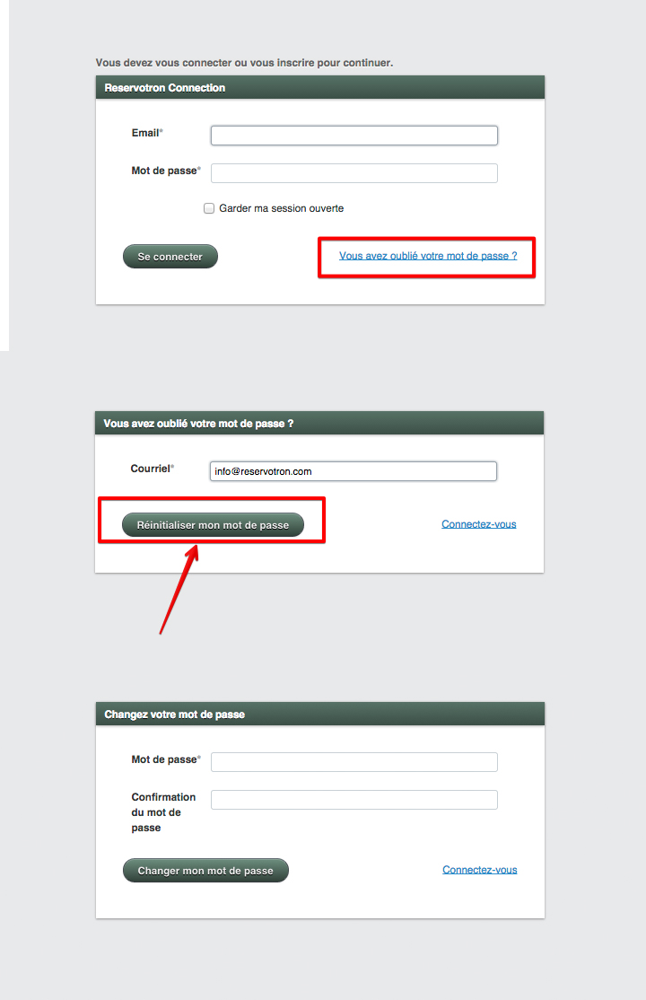

# Réinitialiser le mot de passe

Dans le cas où vous auriez oublié votre mot de passe, vous pourrez le réinitialiser facilement. 

***Pour cela:***
1. Allez à la page de connexion, soit à [reservotron.com/admin](http://reservotron.com/admin)
2. Cliquez sur le lien *"Vous avez oublié votre mot de passe"*
3. Entrez votre courriel et cliquez sur le bouton *"Réinitialiser mon mot de passe"*
4. Vous receverez un courriel incluant un lien de réinitialisation
5. Cliquez sur ce lien
6. Une nouvelle page s'ouvrira, vous permettant d'entrer un nouveau mot de passe
7. Confirmez votre nouveau mot de passe en l'entrant de nouveau
8. Cliquez sur *"Changer mon mot de passe"*

Vous pourrez à présent utiliser votre nouveau mot de passe pour vous connecter 

