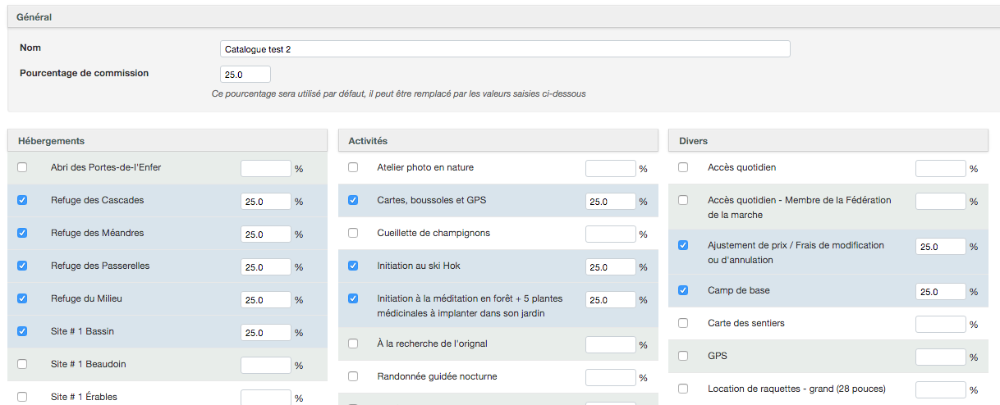
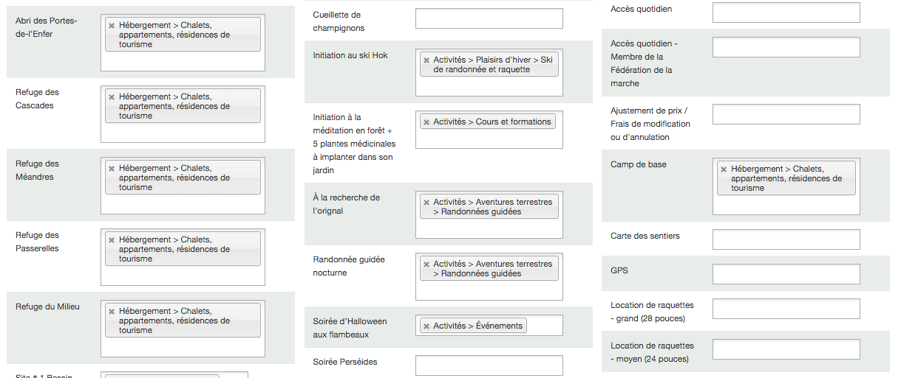

# Revendre l'inventaire d'un fournisseur

##Création d'un catalogue et sélection du partenaire
Pour créer un catalogue, suivez les étapes suivantes:
1. Allez dans Menu → Inventaire → Catalogues
2. Cliquez sur **AJOUTER CATALOGUE**
3. Ajoutez un nom pour votre catalogue
4. Saisissez le pourcentage de la commission du revendeur. *Si vous désirez spécifier une commission différente par item, laissez cette case vide.*
5. Cochez dans les listes les items que vous désirez partager avec le revendeur. Si vous voulez spécifier une commission par item, ajoutez le pourcentage à côté du nom de l'item en question. 
6. Sélectionnez un **PARTENAIRE** dans la liste déroulante. - *Vous pouvez rajouter autant de partenaires que désiré*. Cette option permettra au revendeur d'avoir accès à l'inventaire que vous désirez partager avec lui.
7. Validez le tout en cliquant sur **CREÉR CATALOGUE**.

****

##Ajouter l'inventaire partagé du fournisseur

Une fois l'inventaire du founisseur partagé, vous pouvez l'ajouter à votre compte Réservotron. 

Pour ajouter l'inventaire partagé, suivez les étapes suviantes:

1. Allez dans Menu → Inventaire → Inventaire partagé
2. Vous verrez une liste des items que le fournisseur a partagé avec vous.
3. Dans chaque case blanche, sélectionnez la catégorie à laquelle vous voulez rajouter l'item
4. Répétez cette étape pour l'ensemble des inventaires partagés par des fournisseurs
5. Sauvegardez les changements

****

##Intégration avec le système de votre revendeur

Pour in

1. Créez compte pour le revendeur
2. Partagez l'inventaire désiré avec le compte du revendeur

Le revendeur aura la possibilité de: 
1. Publier votre inventaire et prendre des réservations de ses clients sur son compte Réservotron
2. Publier votre inventaire et prendre des réservations de ses clients sur son site web ([via le widget](ajouter_reservotron_sur_votre_site))
  c. réserver lui même sur son compte réservotron
  d. automatiser l'intégration avec l'API via son compte Reservotron.

l'API permet au revendeur de
1. faire des requêtes automatisée pour connaître vos disponibilités en temps réel
2. créer automatiquement des réservation pour les activités disponibles

https://reservotron.com/swagger-ui/#/default
Sarah Faour·5:12 PM

la démarche pour intégrer l'API ?
David Fugere·5:17 PM

1. télécharger la liste de produits via GET /products

la réponse inclus des attributs de "participant_types" qui sont importants pour le booking
Nicolas Buduroi left the room
David Fugere·5:19 PM

2. obtenir les disponibilités d'un produits via GET /occurrences/{productId}

L'information importante de cette requête est    "openings",  "start_at", "end_at"

3. créer une réservation via POST /bookings

https://reservotron.com/swagger-ui/#!/default/post_bookings

Tu peux réutiliser le texte que je viens d'écrire

cette doc est quand-même simple pour un codeur : https://reservotron.com/swagger-ui

