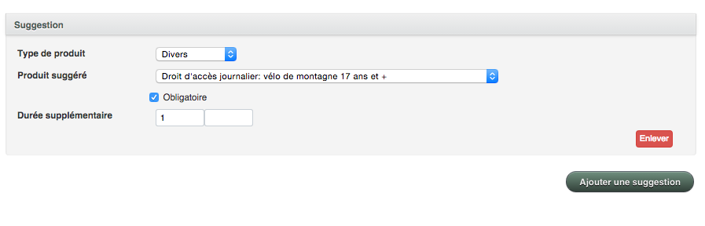

# Suggestions

La réservation d’une activité requiert souvent la location d’un équipement ou même d’un hébergement. Dans ce sens, la fonctionnalité ***Suggestion*** vous permettra de proposer à vos clients des suggestions d’items supplémentaires à réserver en rapport avec les items sélectionnés par le client. 

Ces suggestions apparaitront comme article optionnel dans le panier d’achat lors de la transaction. Si votre client choisit de procéder à l’ajout de votre suggestion à son panier d’achat, les quantités et type de participants seront automatiquement mises à jour de façon à ce qu’elles concordent avec celles inscrites pour la réservation initiale (ex: si le client a réservé une activité pour trois personnes (deux adultes et un enfant), la suggestion sera également pour deux adultes et un enfant). Il restera possible de modifier les quantités via le panier d’achat. 

Si vous créez une activité, vous pouvez suggérer la location de l’équipement nécessaire à celle-ci. Dans ce cas, il faudra spécifier *“divers”* dans le type de produit. Vous pouvez ajouter autant de suggestions que désirez.

***Pour créer des suggestions relatives à une activité:***
1. Allez dans le menu “Inventaire”
1. Sélectionnez  “Activité”
1. Cliquez sur “Ajouter activité”
1. Entrez les informations désirées
1. Cliquez sur “Ajouter suggestion” dans le bas de la page
1. Sélectionnez le type de produit que vous voudriez recommander lorsqu’un client réserve cette activité
1. Sélectionnez le produit que vous voulez suggérer
1. Sauvegardez en cliquant sur “Créer activité”

***Pour créer des suggestions relatives à un hébergement:***
1. Allez dans le menu “Inventaire”
1. Sélectionnez “Hébergement”
1. Cliquez sur “Ajouter hébergement”
1. Entrez les informations désirées
1. Cliquez sur “Ajouter suggestion” dans le bas de la page
1. Sélectionnez le type de produit que vous voudriez recommander lorsqu’un client réserve cet hébergement
1. Sélectionnez le produit que vous voulez suggérer
1. Sauvegardez en cliquant sur “Créer hébergement”

***Pour créer des suggestions relatives à un équipement ou service:***
1. Allez dans le menu “Inventaire”
1. Sélectionnez “Divers”
1. Cliquez sur “Ajouter divers”
1. Entrez les informations désirées
1. Cliquez sur “Ajouter suggestion” dans le bas de la page
1. Sélectionnez le type de produit que vous voudriez recommander lorsqu’un client réserve cet équipement ou service
1. Sélectionnez le produit que vous voulez suggérer
1. Sauvegardez en cliquant sur “Créer divers”

# **Suggestion Obligatoire**

Il est également possible de créer une suggestion obligatoire. Celle-ci s'ajoutera au panier d'achat de façon automatique.

Cette option, très utilisée pour les parc régionaux, vous permettra de vendre obligatoirement un item tel qu'un droit d'accès par exemple lors d'une réservation d'hébergement ou activité.

***Pour créer des suggestions obligatoires relatives à un item de l'inventaire:***

1. Allez dans le menu “Inventaire”
1. Sélectionnez “Activité” ou "Hébergement" (*selon votre besoin*)
1. Cliquez sur “Ajouter item”
1. Entrez les informations désirées
1. Cliquez sur “Ajouter suggestion” dans le bas de la page
1. Sélectionnez le type de produit que vous voudriez recommander lorsqu’un client réserve cette activité
1. Sélectionnez le produit que vous voulez suggérer
2. Cochez la case *OBLIGATOIRE*
3. Entrez la durée supplémentaire désirée
1. Sauvegardez en cliquant sur “Créer item”

