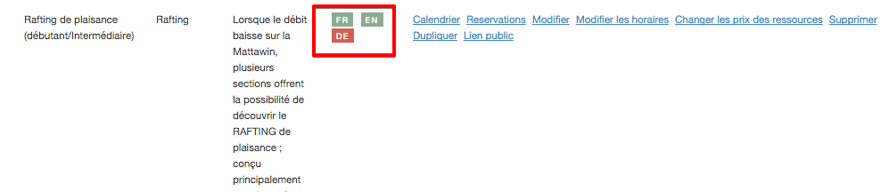

# Traduction

Une fois votre inventaire entré, vous pouvez ajouter sa traduction de sorte à obtenir une plateforme de réservation bilingue. 

Réservotron vous permet d'ajouter des traductions en français, anglais et allemand.

####Pour ajouter la traduction à votre inventaire:
1. Allez dans inventaire et sélectionnez le menu désiré (*exemple: Activités*)
2. Repérez l'item de l'inventaire que vous désirez traduire
3. Cliquez sur l'abbréviation de la langue que vous voulez rajouter. Une case verte signifie que l'article a été entré avec la langue en question. Si la case est rouge, c'est qu'aucune traduction n'a été ajoutée. (*Exemple: Si "FR" est en vert, cela veut dire que l'item est configuré en français. Vous pouvez alors cliquer sur "EN" pour ajouter la version anglaise.*)
4. Après avoir cliqué sur la traduction que vous voulez ajouter, une page s'ouvrira avec votre configuration en français. Modifiez les renseignements et remplacez les par la traduction désirée.
5. Sauvegardez votre article.

Répetez ces étapes pour la totalité de votre inventaire afin de le rendre multilingue.

Une fois sur l'interface cliente, vos clients pourront basculer entre la version française et anglaise de votre compte.

